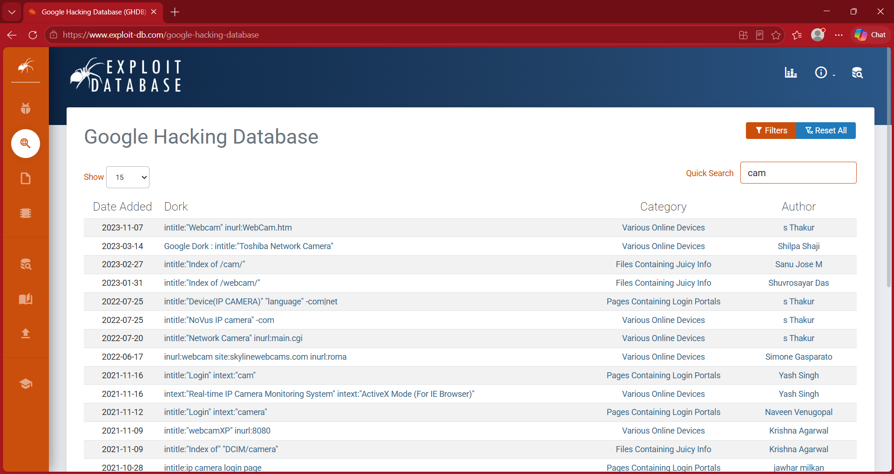
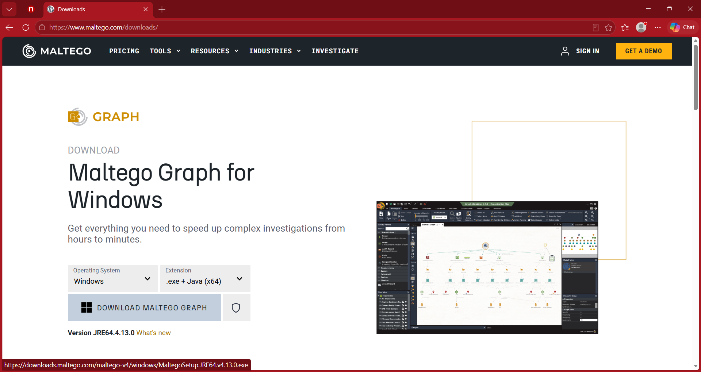
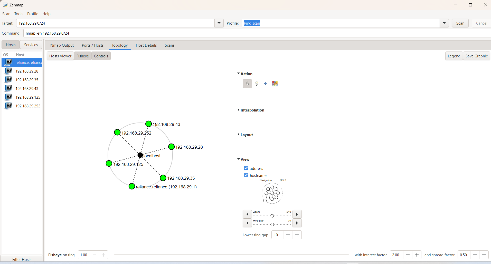

# 🔐 Week 2 Cybersecurity Project

## Networkwalks Cybersecurity Internship

---

## 📌 Project Overview

This repository contains the complete **Week 2 Cybersecurity Internship Project** completed as part of the Networkwalks Cybersecurity Internship.

The Week 2 activities focused on:

- Footprinting and reconnaissance
- Domain and DNS information gathering
- Web technology identification
- Google Hacking Database (GHDB)
- Search-engine reconnaissance
- Passive reconnaissance with Maltego
- Email and domain reconnaissance
- theHarvester
- Network scanning
- Network host discovery
- Zenmap / Nmap
- Security documentation and evidence collection

All activities were performed within the assigned educational and authorized scope.

---

# 👤 Author Information

| Field | Details |
|---|---|
| **Name** | Ishanya Jha |
| **Program/Batch** | B083-Networkwalks |
| **Program** | Cybersecurity Internship |
| **Organization** | Networkwalks |
| **Training Week** | Week 2 |
| **Project Status** | Completed |

---

# 🎯 Week 2 Objectives

The main objectives of Week 2 were to develop practical knowledge of cybersecurity reconnaissance and network discovery techniques.

The project covered:

1. Performing website and DNS footprinting.
2. Collecting publicly available technical information.
3. Using multiple reconnaissance utilities.
4. Understanding Google Hacking Database techniques.
5. Practicing passive reconnaissance with Maltego.
6. Performing email and subdomain reconnaissance with theHarvester.
7. Discovering live hosts on an authorized local network using Zenmap.
8. Documenting technical findings and evidence.
9. Applying responsible cybersecurity practices.

---

# 📚 Modules Completed

| Module | Project | Primary Tools | Status |
|---|---|---|---|
| **W2-PM1** | Footprinting & Reconnaissance | WHOIS, WhatWeb, NSLookup, cURL, Wafw00f, DNSRecon | ✅ Completed |
| **W2-PM2** | Footprinting & Reconnaissance with GHDB | Google / GHDB | ✅ Completed |
| **W2-PM3** | Footprinting with Maltego | Maltego | ✅ Completed |
| **W2-PM4** | Footprinting & Reconnaissance with theHarvester | theHarvester | ✅ Completed |
| **W2-PM5** | Network Scanning with Zenmap | Zenmap / Nmap | ✅ Completed |

---

# 🔎 W2-PM1: Footprinting & Reconnaissance

## 📌 Overview

W2-PM1 focused on website and DNS footprinting using multiple cybersecurity reconnaissance tools.

The module contained six tasks:

- WHOIS
- WhatWeb
- NSLookup
- cURL
- Wafw00f
- DNSRecon

The assigned target domain was:

`networkwalks.com`

---

## 🛠️ Tools Used

| Tool | Purpose |
|---|---|
| **WHOIS** | Domain registration and registrar information |
| **WhatWeb** | Web technology identification |
| **NSLookup** | DNS resolution and lookup |
| **cURL** | HTTP response and header inspection |
| **Wafw00f** | Web application firewall identification |
| **DNSRecon** | DNS reconnaissance |

---

## 📝 Task 1: WHOIS

WHOIS was used to collect domain registration and registrar-related information for the assigned domain.

### Evidence

Output:

`whois_networkwalks.txt`

---

## 📝 Task 2: WhatWeb

WhatWeb was used to identify technologies and web-server information associated with the target website.

### Evidence

Output:

`whatweb_networkwalks.txt`

---

## 📝 Task 3: NSLookup

NSLookup was used to perform DNS resolution and identify the IP address associated with the target domain.

### Evidence

Output:

`nslookup_networkwalks.txt`

---

## 📝 Task 4: cURL

cURL was used to inspect HTTP response information and web-server headers.

### Evidence

Output:

`curl_networkwalks.txt`

---

## 📝 Task 5: Wafw00f

Wafw00f was used to identify the web application firewall associated with the target.

### Evidence

Output:

`wafw00f_networkwalks.txt`

---

## 📝 Task 6: DNSRecon

DNSRecon was used to collect DNS-related information including:

- Name servers
- SOA records
- MX records
- A records
- TXT records
- SRV records

### Evidence

Output:

`dnsrecon_networkwalks.txt`

---

## 📂 W2-PM1 Repository Structure

    WK2-PM1-Footprinting/
    ├── Task-1-WHOIS/
    │   ├── screenshot_whois.png
    │   └── whois_networkwalks.txt
    │
    ├── Task-2-WhatWeb/
    │   ├── screenshot_WhatWeb.png
    │   └── whatweb_networkwalks.txt
    │
    ├── Task-3-NSLookup/
    │   ├── nslookup_networkwalks.txt
    │   └── screenshot_NSLookup.png
    │
    ├── Task-4-cURL/
    │   ├── curl_networkwalks.txt
    │   └── screenshot_cURL.png
    │
    ├── Task-5-Wafw00f/
    │   ├── screenshot_WafW00f.png
    │   └── wafw00f_networkwalks.txt
    │
    └── Task-6-DNSRecon/
        ├── README.md
        ├── screenshot_DNSRecon.png
        └── dnsrecon_networkwalks.txt

---

## 🔐 W2-PM1 Security Relevance

The module demonstrated how publicly accessible domain, DNS, web technology, and HTTP information can contribute to an organization's external footprint.

The activities were limited to reconnaissance and information gathering.

No exploitation or unauthorized access was performed.

---

# 🌐 W2-PM2: Footprinting & Reconnaissance with GHDB

## 📌 Overview

W2-PM2 focused on using the **Google Hacking Database (GHDB)** and search-engine operators for reconnaissance.

The module contained two tasks.

---

## 📝 Task 1: GHDB Webcam Search

The task involved using GHDB-style search operators to identify publicly indexed webcam-related resources.

The results were documented in:

`ghdb_live_cam_result.txt`

### Evidence

Result file:

`ghdb_live_cam_result.txt`

Live-camera screenshots were not included to avoid unnecessarily redistributing surveillance imagery or identifiable individuals.

---

## 📝 Task 2: Mathematics PDF Search

The second task focused on using search operators to identify publicly indexed mathematics PDF directories.

The task documentation was saved as:

`W2-PM2 -Footprinting-&-Reconnaissance-with-GHDB-TABLE.pdf`

Supporting documentation:

`README.md`

---

## 📂 W2-PM2 Repository Structure

    WK2-PM2-GHDB/
    ├── Task-1-GHDB/
    │   ├── ghdb_live_cam_result.txt
    │   └── ghdb_screenshot.png
    │
    └── Task-2-Mathematics-PDF/
        ├── README.md
        └── W2-PM2 -Footprinting-&-Reconnaissance-with-GHDB-TABLE.pdf

---

## 🔐 W2-PM2 Security Relevance

GHDB techniques demonstrate how search engines can unintentionally index sensitive or technically interesting resources.

The exercise highlights the importance of:

- Proper access controls
- Secure web configuration
- Avoiding accidental exposure
- Responsible information gathering
- Ethical handling of publicly indexed information

No authentication bypass or unauthorized access was performed.

---

# 🕵️ W2-PM3: Footprinting with Maltego

## 📌 Overview

W2-PM3 introduced **Maltego** as a reconnaissance and information-gathering platform.

The module focused on:

1. Installing and using Maltego.
2. Performing email reconnaissance against the authorized domain `networkwalks.com`.

---

## 📝 Task 1: Maltego Setup

Maltego was launched and configured for reconnaissance activities.

### Evidence

---

## 📝 Task 2: Email Reconnaissance

Maltego transforms were used to perform reconnaissance related to:

`networkwalks.com`

The documented transform activities included:

- To Email Addresses [Search Engine]
- To Email Addresses [PGP]
- To Emails @domain [Search Engine]

The transform output was saved in:

`Task02-output.txt`

---

## 📸 Maltego Evidence

### Step 1

### Step 2

### Step 3

### Step 4

### Step 5

---

## 🎥 Video Evidence

A video demonstrating the Maltego reconnaissance workflow was recorded:

`PM3-maltego.mp4`

The video documents the execution of the assigned Task 2 workflow.

---

## 📂 W2-PM3 Repository Structure

    WK2-PM3-Maltego/
    ├── PM3-maltego.mp4
    ├── README.md
    ├── Task-01.png
    ├── Task02-output.txt
    ├── maltego Task02-1.png
    ├── maltego Task02-2.png
    ├── maltego Task02-3.png
    ├── maltego Task02-4.png
    └── maltego Task02-5.png

---

## 🔐 W2-PM3 Security Relevance

Maltego demonstrates how multiple publicly available data sources can be correlated during reconnaissance.

The exercise provided practical experience with:

- Domain entities
- Email-related transforms
- Passive reconnaissance
- Search-engine reconnaissance
- PGP-related information
- Visual relationship mapping

The activity was performed only against the assigned domain.

---

# 🔍 W2-PM4: Footprinting & Reconnaissance with theHarvester

## 📌 Overview

W2-PM4 focused on using **theHarvester** for email and subdomain reconnaissance.

The assigned target domain was:

`microsoft.com`

Two reconnaissance tasks were performed.

---

## 📝 Task 1: Baidu Source

theHarvester was used with the Baidu source and a limit of 1000 results.

Command used:

    theHarvester -d microsoft.com -l 1000 -b baidu

### Evidence

### Task 1 Output

---

## 📝 Task 2: All Sources

theHarvester was used with all supported sources and a limit of 50 results.

Command used:

    theHarvester -d microsoft.com -l 50 -b all

### Evidence

### Task 2 Output

---

## 📂 W2-PM4 Repository Structure

    WK2-PM4-theHarvester/
    ├── README.md
    └── img/
        ├── theHarvester-01.png
        ├── theHarvester_task_01.png
        ├── theHarvester_task_02.png
        └── theHarvester_task_02_output.png

---

## 🔐 W2-PM4 Security Relevance

theHarvester demonstrates how publicly available information can be collected from multiple sources during reconnaissance.

The information gathered through such techniques can contribute to understanding an organization's external footprint.

Results from public sources may change over time, so the output represents the state observed during the exercise.

---

# 🖥️ W2-PM5: Network Scanning with Zenmap

## 📌 Overview

W2-PM5 focused on network scanning and host discovery using **Zenmap / Nmap**.

The scan was performed against the authorized local network.

The subnet scanned was:

`192.168.29.0/24`

---

## 🎯 Objectives

The objectives were to:

- Identify the local subnet.
- Scan the network for live hosts.
- Count active hosts.
- Record IP addresses.
- Record available MAC addresses.
- Identify vendor information.
- Generate network topology evidence.

---

## 📝 Task 1: Zenmap Setup

Zenmap was installed and configured for network discovery.

### Evidence

---

## 📝 Task 2: Identify the Local Network

The authorized local subnet used for the scan was:

`192.168.29.0/24`

### Evidence

---

## 📝 Task 3: Find Live Hosts

A host discovery scan was performed against the local subnet.

The scan identified **6 live hosts**.

### Scan Summary

| Item | Result |
|---|---|
| **Subnet Scanned** | `192.168.29.0/24` |
| **Total IP Addresses Scanned** | 256 |
| **Live Hosts Found** | 6 |
| **Nmap Version** | 7.991 |
| **Scan Date** | 19 September 2026 |
| **Scan Duration** | 3.85 seconds |

---

## 📝 Task 4: Count Live Hosts

The final Nmap output reported:

    Nmap done: 256 IP addresses (6 hosts up) scanned in 3.85 seconds

Therefore:

**Total live hosts discovered: 6**

---

## 📝 Task 5: Record IP Addresses

The following IP addresses were identified as live during the scan:

| No. | IP Address | Status |
|---:|---|---|
| 1 | `192.168.29.1` | Host is up |
| 2 | `192.168.29.28` | Host is up |
| 3 | `192.168.29.35` | Host is up |
| 4 | `192.168.29.43` | Host is up |
| 5 | `192.168.29.125` | Host is up |
| 6 | `192.168.29.252` | Host is up |

---

## 📝 Task 6: Record MAC Addresses

The scan identified MAC addresses and vendor information where available.

| No. | IP Address | MAC Address | Vendor |
|---:|---|---|---|
| 1 | `192.168.29.1` | `78:BB:C1:3F:F6:94` | Servercom (India) Private Limited |
| 2 | `192.168.29.28` | `3A:4B:E4:78:68:AD` | Unknown |
| 3 | `192.168.29.35` | `B4:E2:65:39:04:05` | Shenzhen 3dmc Technology |
| 4 | `192.168.29.43` | `90:95:61:13:25:BE` | Hui Zhou Gaoshengda Technology |
| 5 | `192.168.29.125` | `9A:9A:32:22:30:20` | Unknown |
| 6 | `192.168.29.252` | Not shown | Not shown |

> **Security Note:** MAC addresses are included for the private assignment record. If this repository is public, device-identifying information should be redacted.

---

## 🔍 Zenmap Scan Output

### Evidence

---

## 🗺️ Network Topology

The network topology generated during the Zenmap exercise was saved as:

`topology grap.pdf`

---

## 📂 W2-PM5 Repository Structure

    WK2-PM5-Zenmap/
    ├── topology grap.pdf
    ├── zenmap-1.png
    ├── zenmap.png
    ├── zenmap_output.png
    └── README.md

---

# 📊 Overall Week 2 Results

| Module | Area | Result |
|---|---|---|
| **W2-PM1** | Footprinting & Reconnaissance | ✅ Completed |
| **W2-PM2** | GHDB Reconnaissance | ✅ Completed |
| **W2-PM3** | Maltego Reconnaissance | ✅ Completed |
| **W2-PM4** | theHarvester Reconnaissance | ✅ Completed |
| **W2-PM5** | Zenmap Network Scanning | ✅ Completed |

---

# 🧰 Tools Used Throughout Week 2

| Tool | Purpose |
|---|---|
| **WHOIS** | Domain registration and registrar information |
| **WhatWeb** | Web technology identification |
| **NSLookup** | DNS resolution and lookup |
| **cURL** | HTTP response and header inspection |
| **Wafw00f** | Web application firewall identification |
| **DNSRecon** | DNS reconnaissance |
| **GHDB / Google Search Operators** | Search-engine reconnaissance |
| **Maltego** | Passive reconnaissance and data correlation |
| **theHarvester** | Email and subdomain reconnaissance |
| **Zenmap / Nmap** | Network discovery and host scanning |

---

# 🔐 Security & Ethical Considerations

All Week 2 activities were performed for cybersecurity education and within the assigned scope.

The project emphasized reconnaissance, information gathering, and network discovery.

The following activities were not performed:

- Unauthorized system access
- Credential theft
- Password attacks
- Authentication bypass
- Privilege escalation
- Exploitation of vulnerabilities
- Denial-of-service attacks
- Data modification
- Data destruction
- Social engineering
- Testing outside the authorized scope

Information obtained during reconnaissance was treated as security-related data and documented responsibly.

---

# 📖 Learning Outcomes

Completion of Week 2 provided practical experience in:

- Domain footprinting
- DNS reconnaissance
- Web technology identification
- HTTP header analysis
- WAF detection
- Search-engine reconnaissance
- Google Hacking Database techniques
- Passive reconnaissance
- Maltego transforms
- Email reconnaissance
- theHarvester
- Network host discovery
- Nmap scanning
- MAC address identification
- Network topology documentation
- Security evidence collection
- Responsible cybersecurity practices

---

# 📁 Complete Repository Structure

    WEEK-2-CYBERSECURITY-PROJECT/
    │
    ├── README.md
    │
    ├── WK2-PM-FINAL-REPORT/
    │   └── Report
    │
    ├── WK2-PM1-Footprinting/
    │   ├── Task-1-WHOIS/
    │   │   ├── screenshot_whois.png
    │   │   └── whois_networkwalks.txt
    │   │
    │   ├── Task-2-WhatWeb/
    │   │   ├── screenshot_WhatWeb.png
    │   │   └── whatweb_networkwalks.txt
    │   │
    │   ├── Task-3-NSLookup/
    │   │   ├── nslookup_networkwalks.txt
    │   │   └── screenshot_NSLookup.png
    │   │
    │   ├── Task-4-cURL/
    │   │   ├── curl_networkwalks.txt
    │   │   └── screenshot_cURL.png
    │   │
    │   ├── Task-5-Wafw00f/
    │   │   ├── screenshot_WafW00f.png
    │   │   └── wafw00f_networkwalks.txt
    │   │
    │   └── Task-6-DNSRecon/
    │       ├── README.md
    │       ├── screenshot_DNSRecon.png
    │       └── dnsrecon_networkwalks.txt
    │
    ├── WK2-PM2-GHDB/
    │   ├── Task-1-GHDB/
    │   │   ├── ghdb_live_cam_result.txt
    │   │   └── ghdb_screenshot.png
    │   │
    │   └── Task-2-Mathematics-PDF/
    │       ├── README.md
    │       └── W2-PM2 -Footprinting-&-Reconnaissance-with-GHDB-TABLE.pdf
    │
    ├── WK2-PM3-Maltego/
    │   ├── PM3-maltego.mp4
    │   ├── README.md
    │   ├── Task-01.png
    │   ├── Task02-output.txt
    │   ├── maltego Task02-1.png
    │   ├── maltego Task02-2.png
    │   ├── maltego Task02-3.png
    │   ├── maltego Task02-4.png
    │   └── maltego Task02-5.png
    │
    ├── WK2-PM4-theHarvester/
    │   ├── README.md
    │   └── img/
    │       ├── theHarvester-01.png
    │       ├── theHarvester_task_01.png
    │       ├── theHarvester_task_02.png
    │       └── theHarvester_task_02_output.png
    │
    └── WK2-PM5-Zenmap/
        ├── topology grap.pdf
        ├── zenmap-1.png
        ├── zenmap.png
        ├── zenmap_output.png
        └── README.md

---

# ⚠️ Disclaimer

This repository is intended for educational and authorized cybersecurity training purposes.

The techniques and tools demonstrated in this project should only be used against systems, domains, networks, and resources for which explicit authorization has been provided.

Unauthorized scanning, reconnaissance, access attempts, exploitation, or data collection may violate organizational policies and applicable laws.

---

# ✅ Conclusion

The **Week 2 Cybersecurity Internship Project** was successfully completed.

The project covered multiple areas of cybersecurity reconnaissance and network discovery, beginning with domain and DNS footprinting and progressing through GHDB-based reconnaissance, Maltego-based passive reconnaissance, theHarvester information gathering, and authorized local network scanning with Zenmap.

Screenshots, command outputs, reports, video evidence, and topology files have been organized into their respective project-module directories.

The completed work demonstrates practical familiarity with commonly used cybersecurity reconnaissance and network-discovery tools while maintaining an emphasis on authorized and responsible security testing.

---

## 👤 Author

**Ishanya Jha**

Cybersecurity Intern  
**B083-Networkwalks**  
Networkwalks Cybersecurity Internship  
**Week 2 Project**

---

## 📅 Project Information

| Field | Details |
|---|---|
| **Author** | Ishanya Jha |
| **Batch** | B083-Networkwalks |
| **Organization** | Networkwalks |
| **Program** | Cybersecurity Internship |
| **Week** | Week 2 |
| **Modules** | W2-PM1 to W2-PM5 |
| **Project Status** | Completed |

---

# 📌 End of Week 2 Project

**Cybersecurity Internship — Networkwalks**

**Author: Ishanya Jha | B083-Networkwalks**
