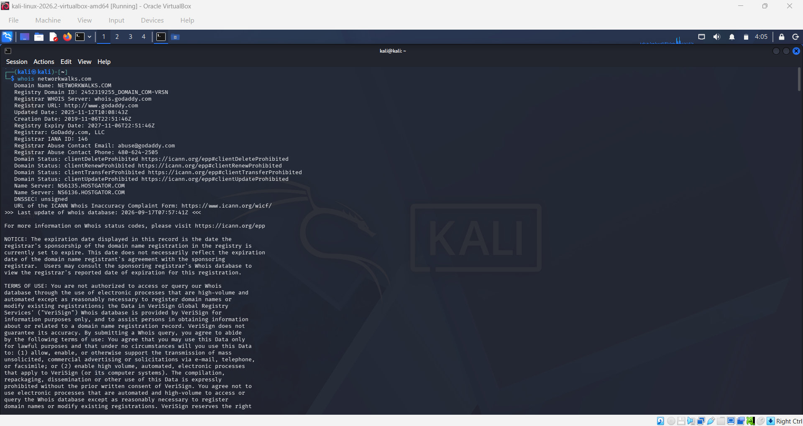
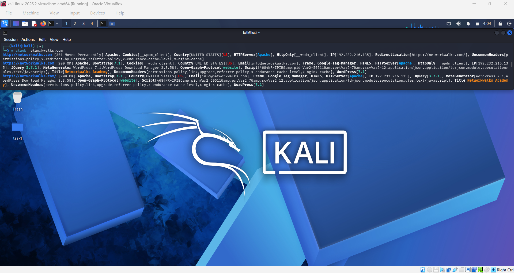
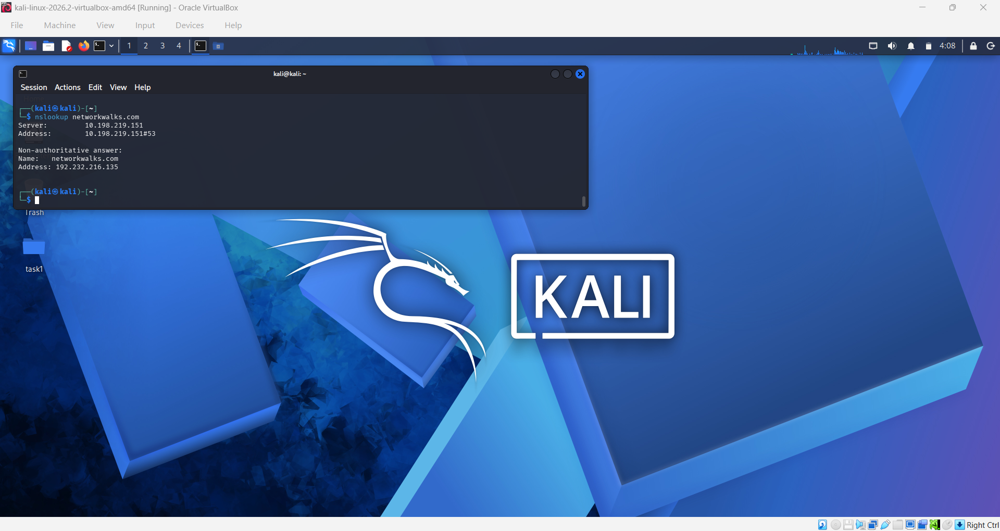
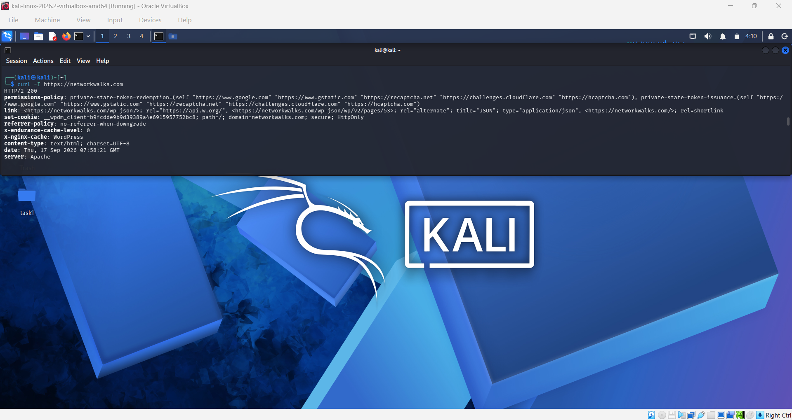
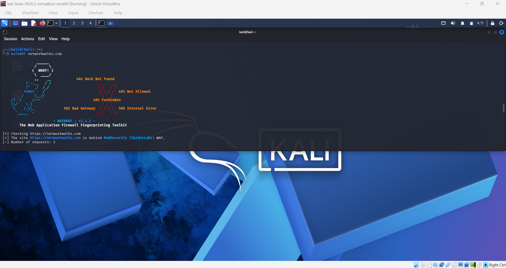
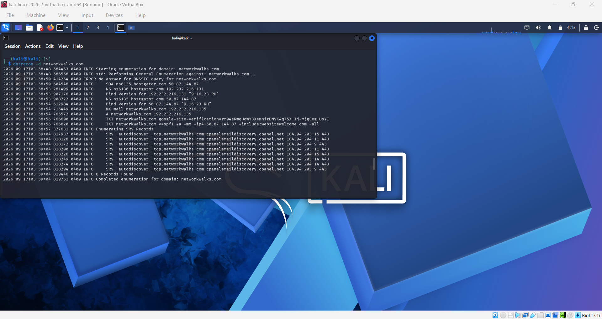

# 🔎 W2-PM1: Footprinting & Reconnaissance

<p align="center">
  <strong>NetworkWalks Cybersecurity Internship • Week 2 • Project Module 1</strong>
</p>

<p align="center">
  
  
  
</p>

## 📌 Overview

This project module demonstrates footprinting and reconnaissance techniques using multiple security tools available in Kali Linux.

The assessment focused on collecting publicly accessible information related to:

- 🌐 Domain registration
- 🖥️ Web technologies and software
- 🌍 DNS resolution
- 📡 HTTP response headers
- 🛡️ Web Application Firewall detection
- 🔍 DNS records and service infrastructure

> **Note:** All findings documented in this README are based on the actual command outputs collected during the practical exercises.

## 🎯 Target

| Information | Value |
|---|---|
| Target Domain | `networkwalks.com` |
| Primary IPv4 | `192.232.216.135` |
| Environment | Kali Linux |
| Assessment Type | Footprinting & Reconnaissance |

## 🧰 Tools Used

| Tool | Purpose |
|---|---|
| 🔎 WHOIS | Domain registration and registrar information |
| 🕵️ WhatWeb | Web technology fingerprinting |
| 🌐 NSLookup | DNS resolution |
| 📡 cURL | HTTP response header inspection |
| 🛡️ Wafw00f | WAF detection |
| 🔍 DNSRecon | DNS record enumeration |

# 1️⃣ WHOIS

## 💻 Command

```bash
whois networkwalks.com
```

## 🎯 Purpose

WHOIS was used to obtain publicly available domain registration and registrar information.

## 📊 Findings

| Information | Result |
|---|---|
| Domain | `NETWORKWALKS.COM` |
| Registrar | GoDaddy.com, LLC |
| Registrar IANA ID | `146` |
| Creation Date | `2019-11-06` |
| Updated Date | `2025-11-12` |
| Registry Expiry Date | `2027-11-06` |
| Name Server | `NS6135.HOSTGATOR.COM` |
| Name Server | `NS6136.HOSTGATOR.COM` |
| DNSSEC | Unsigned |

## 📝 Observation

The WHOIS query exposed publicly available registration metadata, registrar information, registration dates, domain status values, and authoritative name servers.

No specific registrant or owner identity was present in the collected output.

The WHOIS service also indicated that the WHOIS server is being retired in favor of RDAP and displayed a rate-limit message.

## 📸 Screenshot

<p align="center">
  
</p>

## 📄 Raw Output

[📄 View `whois_networkwalks.txt`](Task-1-WHOIS/whois_networkwalks.txt)

# 2️⃣ WhatWeb

## 💻 Command

```bash
whatweb networkwalks.com
```

## 🎯 Purpose

WhatWeb was used to identify publicly observable web technologies, frameworks, server software, and application components.

## 📊 Findings

The HTTP endpoint returned a **301 Moved Permanently** response and redirected to HTTPS.

The HTTPS endpoint returned **200 OK**.

| Technology / Information | Result |
|---|---|
| Web Server | Apache |
| CMS | WordPress 7.1 |
| WordPress Download Manager | 3.3.58 |
| Bootstrap | 7.1 |
| jQuery | 3.7.1 |
| Google Tag Manager | Detected |
| IP Address | `192.232.216.135` |
| Website Title | Networkwalks Academy |
| Public Email | `info@networkwalks.com` |
| HTML5 | Detected |
| Open Graph Protocol | Detected |
| Cookie | `__wpdm_client` |
| HTTP → HTTPS | `301 Redirect` |

## 📝 Observation

WhatWeb identified the website's web server, CMS, software versions, JavaScript library, and other publicly observable components.

This information provides a basic technology profile of the website and can assist security professionals in understanding the externally visible technology stack.

Technology or version disclosure alone does not establish the presence of a vulnerability.

## 📸 Screenshot

<p align="center">
  
</p>

## 📄 Raw Output

[📄 View `whatweb_networkwalks.txt`](Task-2-WhatWeb/whatweb_networkwalks.txt)

# 3️⃣ NSLookup

## 💻 Command

```bash
nslookup networkwalks.com
```

## 🎯 Purpose

NSLookup was used to resolve the domain name and identify its associated IPv4 address.

## 📊 Findings

| Information | Result |
|---|---|
| DNS Server | `10.198.219.151` |
| DNS Server Port | `53` |
| Response Type | Non-authoritative answer |
| Domain | `networkwalks.com` |
| IPv4 Address | `192.232.216.135` |

## 📝 Observation

The domain successfully resolved to the IPv4 address `192.232.216.135`.

The response was identified as non-authoritative because the result was returned by the configured DNS resolver rather than directly from an authoritative DNS server.

## 📸 Screenshot

<p align="center">
  
</p>

## 📄 Raw Output

[📄 View `nslookup_networkwalks.txt`](Task-3-NSLookup/nslookup_networkwalks.txt)

# 4️⃣ cURL

## 💻 Command

```bash
curl -I https://networkwalks.com
```

## 🎯 Purpose

cURL was used to inspect the HTTP response headers returned by the HTTPS web server.

## 📊 Findings

The server returned:

```text
HTTP/2 200
```

Important headers observed:

| Header | Observed Information |
|---|---|
| `server` | Apache |
| `content-type` | `text/html; charset=UTF-8` |
| `referrer-policy` | `no-referrer-when-downgrade` |
| `x-endurance-cache-level` | `0` |
| `x-nginx-cache` | WordPress |
| `permissions-policy` | Private State Token policies |
| `link` | WordPress REST API references |
| `set-cookie` | `__wpdm_client` with `Secure` and `HttpOnly` |

The `Link` header referenced the WordPress REST API:

```text
/wp-json/
```

## 📝 Observation

The HTTP response headers revealed information about the web server, content type, caching configuration, security-related policies, cookies, and WordPress API functionality.

These headers provide useful reconnaissance information about the externally visible HTTP configuration.

> ⚠️ **Security Note:** The original command output contained a cookie value. The value should be redacted before publishing the raw output or screenshot to a public repository.

## 📸 Screenshot

<p align="center">
  
</p>

## 📄 Raw Output

[📄 View `curl_networkwalks.txt`](Task-4-cURL/curl_networkwalks.txt)

# 5️⃣ Wafw00f

## 💻 Command

```bash
wafw00f networkwalks.com
```

## 🎯 Purpose

Wafw00f was used to determine whether a Web Application Firewall was protecting the website.

## 📊 Findings

| Information | Result |
|---|---|
| Wafw00f Version | `2.4.2` |
| Target | `https://networkwalks.com` |
| WAF Detected | ModSecurity (SpiderLabs) |
| Number of Requests | `2` |

## 📝 Observation

Wafw00f identified ModSecurity (SpiderLabs) as the Web Application Firewall protecting the website.

A WAF provides an additional defensive layer for web applications by inspecting and filtering HTTP requests.

The detection of a WAF does not itself indicate the presence or absence of a vulnerability.

## 📸 Screenshot

<p align="center">
  
</p>

## 📄 Raw Output

[📄 View `wafw00f_networkwalks.txt`](Task-5-Wafw00f/wafw00f_networkwalks.txt)

# 6️⃣ DNSRecon

## 💻 Command

```bash
dnsrecon -d networkwalks.com
```

## 🎯 Purpose

DNSRecon was used to enumerate publicly accessible DNS records associated with the target domain.

## 📊 Findings

### SOA Record

```text
ns6135.hostgator.com → 50.87.144.87
```

### NS Records

```text
ns6136.hostgator.com → 192.232.216.131
ns6135.hostgator.com → 50.87.144.87
```

### BIND Version

DNSRecon reported:

```text
9.16.23-RH
```

for both detected name servers.

### MX Record

```text
mail.networkwalks.com → 192.232.216.135
```

### A Record

```text
networkwalks.com → 192.232.216.135
```

### TXT Records

A Google site-verification TXT record was identified.

An SPF record was also identified:

```text
v=spf1 +a +mx +ip4:50.87.144.87 +include:websitewelcome.com ~all
```

### SRV Records

DNSRecon identified:

```text
_autodiscover._tcp.networkwalks.com
```

pointing to:

```text
cpanelemaildiscovery.cpanel.net
```

on port:

```text
443
```

DNSRecon reported **8 SRV records** for this autodiscovery service.

### DNSSEC

DNSRecon reported:

```text
ERROR No answer for DNSSEC query for networkwalks.com
```

## 📝 Observation

DNSRecon revealed publicly accessible information about the domain's DNS infrastructure, including authoritative name servers, web hosting, mail infrastructure, TXT records, SPF configuration, and email autodiscovery services.

The BIND version reported by DNSRecon represents version disclosure observed during enumeration. It was not treated as evidence of a vulnerability.

## 📸 Screenshot

<p align="center">
  
</p>

## 📄 Raw Output

[📄 View `dnsrecon_networkwalks.txt`](Task-6-DNSRecon/dnsrecon_networkwalks.txt)

# 📋 Overall Reconnaissance Summary

| Category | Finding |
|---|---|
| 🌐 Domain | `networkwalks.com` |
| 🌍 IPv4 Address | `192.232.216.135` |
| 🏢 Registrar | GoDaddy.com, LLC |
| 📡 Name Servers | `NS6135.HOSTGATOR.COM`, `NS6136.HOSTGATOR.COM` |
| 🖥️ Web Server | Apache |
| 📰 CMS | WordPress 7.1 |
| 📦 WordPress Download Manager | 3.3.58 |
| ⚙️ jQuery | 3.7.1 |
| 🛡️ WAF | ModSecurity (SpiderLabs) |
| 📧 Mail Host | `mail.networkwalks.com` |
| 🔐 DNSSEC | No DNSSEC answer reported |
| 📨 SPF | Published |
| 🔄 Email Autodiscovery | `_autodiscover._tcp.networkwalks.com` |
| 🔒 HTTPS | HTTP/2 `200 OK` |

# 🛡️ Security Relevance

The reconnaissance exercise demonstrated how publicly accessible information can reveal details about an organization's external infrastructure.

The collected information included:

- Domain registration information
- DNS name servers
- IP addressing information
- Web server technology
- CMS and software versions
- HTTP response headers
- WAF technology
- Mail infrastructure
- SPF configuration
- TXT records
- Email autodiscovery services

This information can assist security professionals in building an initial understanding of an organization's external attack surface during an authorized assessment.

The findings represent reconnaissance observations and should not automatically be interpreted as security vulnerabilities.

# 📁 Evidence Structure

```text
W2-PM1-Footprinting/
│
├── Task-1-WHOIS/
│   ├── screenshot_whois.png
│   └── whois_networkwalks.txt
│
├── Task-2-WhatWeb/
│   ├── screenshot_WhatWeb.png
│   └── whatweb_networkwalks.txt
│
├── Task-3-NSLookup/
│   ├── screenshot_NSLookup.png
│   └── nslookup_networkwalks.txt
│
├── Task-4-cURL/
│   ├── screenshot_cURL.png
│   └── curl_networkwalks.txt
│
├── Task-5-Wafw00f/
│   ├── screenshot_WafW00f.png
│   └── wafw00f_networkwalks.txt
│
├── Task-6-DNSRecon/
│   ├── screenshot_DNSRecon.png
│   └── dnsrecon_networkwalks.txt
│
└── README.md
```

# 🎓 Learning Outcomes

By completing this module, the following practical skills were demonstrated:

- ✅ Domain reconnaissance using WHOIS
- ✅ Web technology fingerprinting using WhatWeb
- ✅ DNS resolution using NSLookup
- ✅ HTTP header analysis using cURL
- ✅ WAF identification using Wafw00f
- ✅ DNS enumeration using DNSRecon
- ✅ Collection and organization of reconnaissance evidence
- ✅ Documentation of technical findings
- ✅ Interpretation of reconnaissance data from a security perspective

# 🔐 Ethical & Legal Considerations

All reconnaissance activities should be performed only against systems for which appropriate authorization has been obtained.

This module focuses on information gathering and reconnaissance. No exploitation, unauthorized access, credential attacks, denial-of-service activity, or modification of systems was performed.

# 🏁 Conclusion

W2-PM1 provided practical experience with six commonly used reconnaissance tools in Kali Linux.

WHOIS provided domain registration information, WhatWeb identified web technologies, NSLookup resolved the domain, cURL examined HTTP headers, Wafw00f detected the web application firewall, and DNSRecon enumerated publicly accessible DNS records.

Together, these techniques demonstrate how publicly available information can be systematically collected and organized to build an initial technical profile of a web domain during an authorized security assessment.

<p align="center">
  <strong>NetworkWalks Cybersecurity Internship • W2-PM1</strong>
</p>
