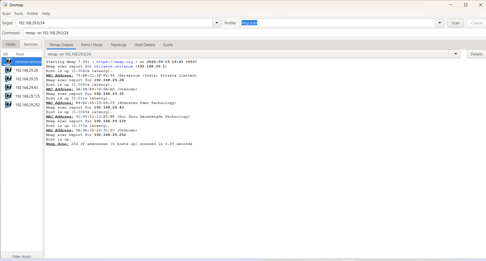
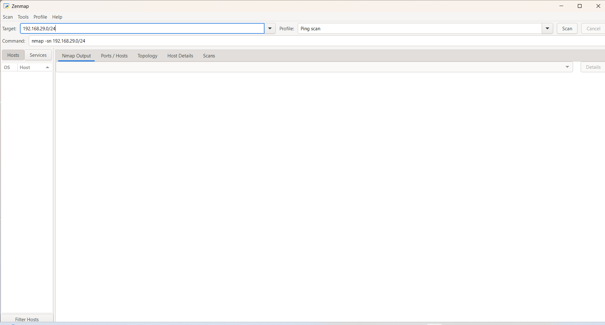

# 🔎 W2-PM5: Network Scanning with Zenmap

## 📌 Overview

This project module covers **network scanning and host discovery using Zenmap**, the graphical interface for Nmap.

The objective was to identify live hosts on the authorized local LAN, record their IP and MAC addresses, determine the number of active hosts, and save the resulting network topology as evidence.

All scanning activities were performed only against the authorized local network.

---

## 📋 Project Information

| Field | Details |
|---|---|
| **Program** | Cybersecurity & Ethical Hacking Internship |
| **Organization** | Networkwalks |
| **Training Week** | Week 2 |
| **Project Module** | W2-PM5 |
| **Module Title** | Network Scanning with Zenmap |
| **Primary Tool** | Zenmap / Nmap |
| **Security Domain** | Network Scanning & Network Discovery |
| **Testing Approach** | Local Network Scanning |
| **Authorization** | Authorized local LAN |
| **Status** | Completed |

---

## 🎯 Objectives

The objectives of this module were to:

- Install and use Zenmap.
- Identify the local IP address and subnet.
- Scan the local subnet for live hosts.
- Count the number of active hosts.
- Record discovered IP addresses.
- Record available MAC addresses and vendor information.
- Generate and save a network topology.
- Document the scan results for the Week 2 cybersecurity report.

---

## 🛠️ Tool Used

### Zenmap

Zenmap is the graphical user interface for Nmap. It provides a convenient way to perform network discovery and visualize scan results.

Nmap was used to perform a host discovery scan against the authorized local subnet:

```text
192.168.29.0/24

# 🧪 Tasks Performed

## Task 1: Install Zenmap

Zenmap was installed and configured on the system for network discovery and scanning.

### Evidence



---

## Task 2: Identify the Local Network

The local network was identified before starting the scan.

The subnet used for the authorized scan was:

```text
192.168.29.0/24
```

This subnet contains 256 IPv4 addresses.

### Evidence



---

## Task 3: Find Live Hosts

A host discovery scan was performed against the local subnet.
The scan identified 6 live hosts.
The scan covered: `192.168.29.0/24`

### Scan Summary

| Item | Result |
|---|---|
| **Subnet Scanned** | 192.168.29.0/24 |
| **Total IP Addresses Scanned** | 256 |
| **Live Hosts Found** | 6 |
| **Nmap Version** | 7.991 |
| **Scan Date** | 19 September 2026 |
| **Scan Duration** | 3.85 seconds |

---

## Task 4: Count Live Hosts

The final Nmap output reported:
> `Nmap done: 256 IP addresses (6 hosts up) scanned in 3.85 seconds`

Therefore:
**Total live hosts discovered:** 6

---

## Task 5: Record IP Addresses

The following IP addresses were identified as live during the scan:

| No. | IP Address | Status |
|:---:|---|---|
| 1 | 192.168.29.1 | Host is up |
| 2 | 192.168.29.28 | Host is up |
| 3 | 192.168.29.35 | Host is up |
| 4 | 192.168.29.43 | Host is up |
| 5 | 192.168.29.125 | Host is up |
| 6 | 192.168.29.252 | Host is up |

---

## Task 6: Record MAC Addresses

The scan also identified MAC addresses and vendor information for the hosts where this information was available.

| No. | IP Address | MAC Address | Vendor |
|:---:|---|---|---|
| 1 | 192.168.29.1 | 78:BB:C1:3F:F6:94 | Servercom (India) Private Limited |
| 2 | 192.168.29.28 | 3A:4B:E4:78:68:AD | Unknown |
| 3 | 192.168.29.35 | B4:E2:65:39:04:05 | Shenzhen 3dmc Technology |
| 4 | 192.168.29.43 | 90:95:61:13:25:BE | Hui Zhou Gaoshengda Technology |
| 5 | 192.168.29.125 | 9A:9A:32:22:30:20 | Unknown |
| 6 | 192.168.29.252 | Not shown in supplied output | Not shown |

> **Security Note:** MAC addresses identify network interfaces. If this repository is public, sensitive device-identifying information should be redacted before publication.

---

## 🔍 Nmap Scan Output

The scan produced the following results:

```text
Starting Nmap 7.991 ([https://nmap.org](https://nmap.org)) at 2026-09-19 19:41 +0530

Nmap scan report for reliance.reliance (192.168.29.1)
Host is up (0.0040s latency).
MAC Address: 78:BB:C1:3F:F6:94 (Servercom (India) Private Limited)

Nmap scan report for 192.168.29.28
Host is up (0.00805s latency).
MAC Address: 3A:4B:E4:78:68:AD (Unknown)

Nmap scan report for 192.168.29.35
Host is up (0.011s latency).
MAC Address: B4:E2:65:39:04:05 (Shenzhen 3dmc Technology)

Nmap scan report for 192.168.29.43
Host is up (0.00695s latency).
MAC Address: 90:95:61:13:25:BE (Hui Zhou Gaoshengda Technology)

Nmap scan report for 192.168.29.125
Host is up (0.073s latency).
MAC Address: 9A:9A:32:22:30:20 (Unknown)

Nmap scan report for 192.168.29.252
Host is up.

Nmap done: 256 IP addresses (6 hosts up) scanned in 3.85 seconds
```

---

## 🗺️ Network Topology

The network topology generated during the Zenmap exercise was saved as:
`topology grap.pdf`

### Evidence

The topology PDF is included in this repository as supporting evidence.

---

## 📁 Repository Structure

```text
WK2-PM5-Zenmap/
├── README.md
├── topology grap.pdf
├── zenmap-1.png
├── zenmap.png
└── zenmap_output.png
```

---

## 📊 Results Summary

| Category | Result |
|---|---|
| **Network** | 192.168.29.0/24 |
| **Addresses Scanned** | 256 |
| **Live Hosts** | 6 |
| **Tool** | Zenmap / Nmap |
| **Nmap Version** | 7.991 |
| **Scan Duration** | 3.85 seconds |
| **Topology Evidence** | `topology grap.pdf` |
| **Module Status** | Completed |

---

## 🔐 Security Relevance

Network discovery is an important part of cybersecurity assessment because it helps identify active devices within an authorized network. 
The results can be used to:

*   Identify active hosts.
*   Understand the local network structure.
*   Identify device manufacturers from MAC addresses.
*   Build an initial network inventory.
*   Support later security assessment activities.
*   Detect unexpected or unknown devices on a network.

> No exploitation, credential attacks, privilege escalation, denial-of-service activity, or unauthorized access was performed as part of this module.

---

## ⚖️ Ethical & Legal Considerations

All scanning was performed against the authorized local network for educational and cybersecurity training purposes. The exercise was limited to network discovery and identification of live hosts.

No attempt was made to:
*   Access unauthorized systems.
*   Bypass authentication.
*   Exploit vulnerabilities.
*   Capture credentials.
*   Modify or delete data.
*   Disrupt network services.
*   Scan systems outside the authorized scope.

---

## 🎓 Learning Outcomes

After completing this module, the following skills were practiced:

*   Using Zenmap for network discovery.
*   Understanding IPv4 CIDR notation.
*   Identifying live hosts.
*   Reading Nmap scan results.
*   Identifying MAC addresses.
*   Interpreting vendor information.
*   Counting active hosts.
*   Generating network topology evidence.
*   Documenting network reconnaissance results responsibly.

---

## 📸 Evidence

The following evidence files are included in this repository:

| Evidence | File |
|---|---|
| Zenmap setup/configuration | `zenmap-1.png` |
| Network scanning | `zenmap.png` |
| Scan output | `zenmap_output.png` |
| Network topology | `topology grap.pdf` |

---

## ⚠️ Disclaimer

This project was completed for authorized cybersecurity education and training. 
The techniques demonstrated in this module should only be used on systems and networks for which explicit authorization has been provided. 
Unauthorized network scanning or security testing may violate organizational policies and applicable laws.

---

## ✅ Conclusion

The W2-PM5 Network Scanning with Zenmap module was successfully completed.
The authorized local subnet `192.168.29.0/24` was scanned, resulting in 6 live hosts being identified. Their available IP addresses, MAC addresses, and vendor information were documented, and a network topology was generated as supporting evidence.

This exercise provided practical experience with network discovery and demonstrated how Zenmap/Nmap can be used to build an initial understanding of an authorized network environment.

---

## 👤 Author

**Ishanya Jha**
*Cybersecurity & Ethical Hacking Intern*
B083-Networkwalks
Networkwalks Cybersecurity Internship
Week 2 Project Module 5
